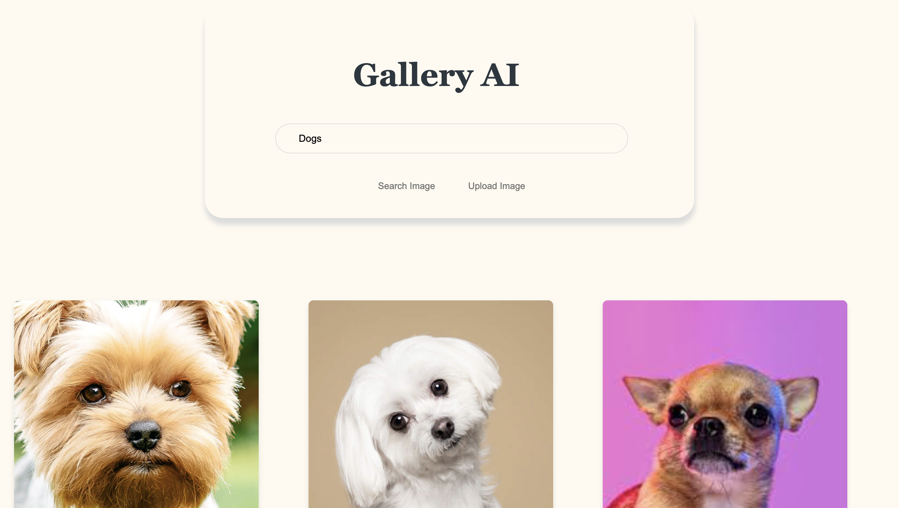

# Gallery AI

This is a PHP-based web-app built as part of the Cloud computing course (CS-GY 9223) at New York University. Allows users to search for images with text. Powered by AWS components.


## Prerequisites

Before you begin, ensure you have the following installed:
- PHP 7.4 or higher
- cURL support enabled in PHP
- A web server like Apache or Nginx

## Installation

1. **Clone the Repository**
   ```
   git clone https://github.com/yourusername/galleryai.git
   cd galleryai
   ```

2. **Set Up Environment**
   ```
   API_KEY='YOUR_API_KEY_HERE'
   ```

### Demo

